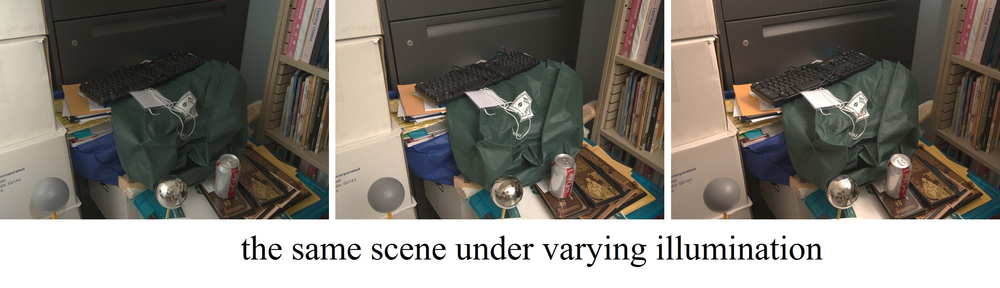
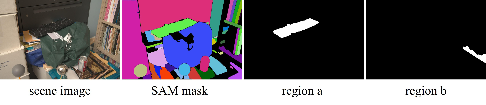
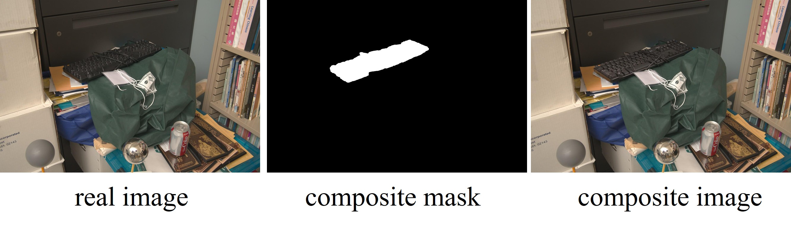

# Image-Harmonization-Dataset-HMIIW

Our HMIIW dataset is built upon [MIIW](https://projects.csail.mit.edu/illumination/) dataset provided by the following paper:

> **A Dataset of Multi-Illumination Images in the Wild**  [[arXiv]](https://arxiv.org/pdf/1910.08131) [[pdf]](https://ieeexplore.ieee.org/stamp/stamp.jsp?tp=&arnumber=9008252)<br>
>
> Lukas Murmann, Michael Gharbi, Miika Aittala, Fredo Durand<br>
> Accepted by **ICCV 2019**.


MIIW contains 1015 (985 training and 30 test) indoor scenes, in which each scene has 25 images with the same content captured under 25 different illumination conditions. 

<div align="center">

</div>

For each sene, we use [SAM](https://github.com/facebookresearch/segment-anything) to get segmentation mask and randomly select two regions. The selected regions should satisfy the following requirements: 
1.The area ratio of region is above 1% and below 40%;
2.The region should exclude two light probes, a reflective chrome sphere and a plastic gray sphere.
If a scene does not have any qualified region, we directly skip this scene. If a scene only has one qualified region, we just use one region for this scene. 

Finally, we have 959 scenes with two qualified regions and 30 scenes with one qualified region.
For each scene X, we store the binary composite masks X_a.png for region a and X_b.png for region b. 

<div align="center">

</div>

Then, for each scene X, we randomly select 3 images {X_Y1.jpg, X_Y2.jpg, X_Y3.jpg}  as ground-truth real images. For each real image and each region, e.g., X_Y1.jpg and X_a.png, 
we randomly select another image X_Z1.jpg from the same scene yet different illumination. In practice, we calculate MSE between X_Y1.jpg and all other X_Z.jpg within region a and rank all other X_Z.jpg in a decreasing order,
after which X_Z1.jpg is randomly selected from top 8 images to ensure that X_Y1.jpg and X_Z1.jpg have perceivable difference within foreground region a. 

We combine the foreground region of X_Z1.jpg and background region of X_Y1.jpg, 
leading to the composite image X_Y1_a_Z1.jpg. The composite image, composite foreground mask, and real image form a training tuple {X_Y1_a_Z1.jpg, X_a.png, X_Y1.jpg}. 

<div align="center">

</div>

Finally, we have 5844 composite images, 1948 composite masks, and 2967 real images. Our HMIIW dataset is provided in [**Baidu Cloud**](https://pan.baidu.com/s/1ZGywdz7_MzBUFao2Sthamw?pwd=8ki2) or [**Dropbox**](https://www.dropbox.com/scl/fo/iw0z0bkzkdnkn3rqnb89f/ALG9ehqLuD8GvK0QiGiEXA4?rlkey=d6w5rrq2jj5be1q9hr34yd6ed&st=ojuy7rdf&dl=0). The file structure is as follows:

  ```
  ├── composite_images:
       ├── X1_Y1_a_Z1.jpg
       ├── X1_Y1_b_Z2.jpg
       ├── ……
  ├── composite_masks:
       ├── X1_a.png
       ├── X1_b.png
       ├── ……
  ├── real_images:
       ├── X1_Y1.jpg
       ├── ……
 ├── SAM_masks:
       ├── X1.png
       ├── ……
  ```


